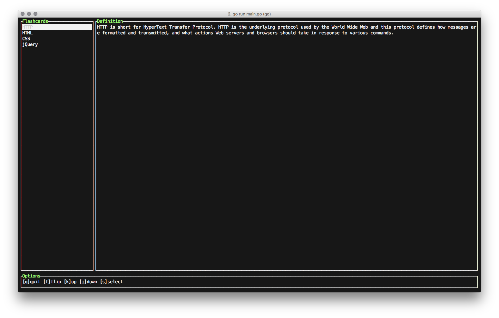

# FlashCards

[Flashcard](https://en.wikipedia.org/wiki/Flashcard) app for the terminal.



Getting started
---------------

1. [Download](https://github.com/berto/flashcards/releases) and place where you can access it from
   the command line like, `/usr/local/bin` 

   Or use wget

    ```bash
    $ brew install wget
    $ wget https://github.com/berto/flashcards/releases/download/0.0.1/flashcards
    $ chmod u+x flashcards
    $ mv flashcards /usr/local/bin
    ```

   Or via Go:

    ```bash
    $ go get github.com/berto/flashcards   
    ```
 
2. Create a `.flashcards.json` file, place it in your home directory. 

   For a quick start, copy the one in the assets folder:

    ```bash
    $ wget https://raw.githubusercontent.com/berto/flashcards/master/assets/.flashcards.json
    $ mv .flashcards.json ~/
    ``` 

   The file should resemble the following structure:

    ```javascript
    {
      "flashcards": [
        {
          "name": "HTTP",
          "definition": "HTTP is short for HyperText Transfer Protocol. HTTP is the underlying protocol used by the World Wide Web and this protocol defines how messages are formatted and transmitted, and what actions Web servers and browsers should take in response to various commands."
        },
        {
          "name": "HTML",
          "definition": "HyperText Markup Language (HTML) is the standard markup language for creating web pages and web applications. With Cascading Style Sheets (CSS), and JavaScript, it forms a triad of cornerstone technologies for the World Wide Web."
        },
        {
          "name": "CSS",
          "definition": "Cascading Style Sheets (CSS) is a style sheet language used for describing the presentation of a document written in a markup language."
        },
        {
          "name": "jQuery",
          "definition": "A fast, concise, library that simplifies how to traverse HTML documents, handle events, perform animations, and AJAX."
        }
      ]
    }
    ```

3. Run `flashcards`: 

    ```bash
    $ flashcards 

    // for list of comands and usage
    $ flashcards -h
    ``` 
